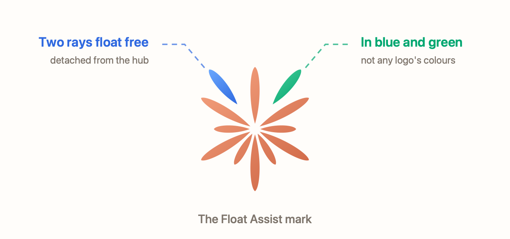

<p align="center">
  
</p>

<p align="center">
  
  
  
  
  <a href="LICENSE"></a>
</p>

<p align="center"><em><a href="README.md">Read this document in English →</a></em></p>

---

**Float Assist** est une petite application macOS native qui garde un assistant web à une
frappe de distance. Un raccourci global fait apparaître un panneau flottant par-dessus ce
que vous êtes en train de faire ; le même raccourci le fait disparaître. Claude, Gemini et
ChatGPT conservent chacun leur session, stockée par WebKit sur votre Mac.

L'application est écrite en Swift avec SwiftUI, AppKit et WebKit. Aucun paquet externe,
aucune télémétrie, aucun compte propre à l'application.

## Fonctionnalités

- **Raccourci global.** Afficher ou masquer le panneau flottant depuis n'importe quelle application.
- **Demander avec le presse-papiers.** Un second raccourci ouvre le panneau et insère directement le texte du presse-papiers dans le champ de saisie de l'assistant.
- **Garder ouvert.** Un interrupteur épingle le panneau : il reste visible même lorsque vous cliquez ailleurs.
- **Panneau ou fenêtre.** Travaillez dans le panneau compact, ou ouvrez la fenêtre complète quand il vous faut de la place.
- **Trois assistants.** Claude, Gemini et ChatGPT, chacun avec son propre stockage de données de site WebKit.
- **Il vous suit.** Le panneau rejoint tous les bureaux et flotte au-dessus des applications en plein écran.
- **Raccourcis enregistrables.** Réglez les deux raccourcis dans les réglages et restaurez les valeurs par défaut à tout moment.
- **Réinitialisation des données de site.** Effacez cookies, caches et sessions de connexion de tous les assistants en une action.

## Raccourcis

| Action | Par défaut | Où |
| --- | --- | --- |
| Afficher ou masquer le panneau flottant | <kbd>⌥</kbd> <kbd>Espace</kbd> | Partout, à l'échelle du système |
| Demander avec le texte du presse-papiers | <kbd>⇧</kbd> <kbd>⌥</kbd> <kbd>Espace</kbd> | Partout, à l'échelle du système |
| Afficher le panneau flottant | <kbd>⌘</kbd> <kbd>⌥</kbd> <kbd>F</kbd> | Menu de l'application |
| Demander avec le texte du presse-papiers | <kbd>⇧</kbd> <kbd>⌘</kbd> <kbd>⌥</kbd> <kbd>F</kbd> | Menu de l'application |
| Fermer le panneau | <kbd>esc</kbd> | Panneau au premier plan |

Les deux raccourcis globaux se modifient dans **Réglages → Global shortcuts**. Un raccourci
doit contenir au moins un modificateur ; videz un enregistreur pour le désactiver. Si macOS
a déjà réservé une combinaison, Float Assist continue de fonctionner et signale l'erreur
dans la fenêtre au lieu de s'arrêter.

## Configuration requise

- macOS 26 ou version ultérieure
- Un Mac Apple Silicon
- Xcode 26 ou version ultérieure pour compiler depuis les sources

## Installation

Ouvrez `FloatAssist.dmg` et glissez **Float Assist** dans Applications.

Les binaires produits par ce dépôt ne sont **ni signés ni notarisés** : au premier
lancement, faites un clic droit sur l'application, choisissez **Ouvrir**, puis confirmez.
Signez et notarisez avec votre propre identifiant de développeur avant toute distribution
plus large.

Float Assist s'exécute comme une application de barre de menus (`LSUIElement`) : elle
n'apparaît pas dans le Dock, cherchez la marque dans la barre de menus.

## Compiler depuis les sources

```bash
xcodebuild build \
  -project FloatAssist.xcodeproj \
  -scheme FloatAssist \
  -destination 'platform=macOS,arch=arm64' \
  CODE_SIGNING_ALLOWED=NO
```

Fabriquer une image disque à partir d'un build Release :

```bash
./scripts/create-dmg.sh \
  "./build/DerivedData/Build/Products/Release/Float Assist.app" \
  ./dist
```

Les tests, la configuration Release et l'image disque sont détaillés dans
[docs/BUILD.md](docs/BUILD.md).

## La marque

<p align="center">
  
</p>

La marque est une étoile rayonnante — un clin d'œil assumé à la famille de logos des
assistants que Float Assist ouvre. Deux rayons se sont détachés du centre et dérivent, l'un
bleu et l'autre vert : ces rayons, c'est le panneau flottant, et c'est eux qui empêchent de
confondre cette marque avec les leurs.

L'icône de l'application, le glyphe de la barre de menus, la marque in-app et l'illustration
ci-dessus sont tous générés, pour que l'identité soit reproductible plutôt que placée à la
main :

```bash
swift scripts/generate-branding.swift .
```

## Confidentialité

Float Assist n'a ni serveur, ni compte, ni analytique. L'application ouvre dans une vue
WebKit les sites d'assistants que vous choisissez ; l'authentification, les données que vous
saisissez et les règles propres à chaque service restent gérées par ce site. Les sessions
vivent dans le stockage WebKit de ce Mac, un stockage par assistant, et **Réglages →
Privacy → Reset Website Data** les supprime toutes.

L'application est en bac à sable avec le runtime durci, uniquement les connexions réseau
sortantes, et aucun accès à la caméra, au micro, aux contacts, aux calendriers, à la
localisation ou à l'USB.

## Technologies

SwiftUI, AppKit, WebKit, Foundation, Observation et Carbon (pour les raccourcis globaux),
ainsi que XCTest pour les tests. Rien d'autre : les instructions de compilation de ce dépôt
ne téléchargent aucun paquet externe.

## Aucune affiliation

Float Assist est un projet indépendant. Il n'est ni affilié à, ni approuvé, ni sponsorisé
par Anthropic, Google ou OpenAI. Claude, Gemini et ChatGPT sont des marques de leurs
détenteurs respectifs, et la marque ci-dessus est une création originale, distincte des
leurs. L'utilisation de chaque service reste régie par les conditions de ce service.

## Licence

Float Assist est publié sous **licence MIT** — le texte complet est dans
[LICENSE](LICENSE). Chaque fichier source du dépôt porte la même mention :

```swift
//  Copyright (c) 2026 Alban Gerschheimer. Licensed under the MIT License.
```

En résumé : vous pouvez utiliser, copier, modifier, fusionner, publier, distribuer,
sous-licencier et vendre des copies du logiciel, à condition que la mention de copyright et
la mention d'autorisation voyagent avec lui. Le logiciel est fourni « tel quel », sans
garantie d'aucune sorte.

© 2026 Alban Gerschheimer.
