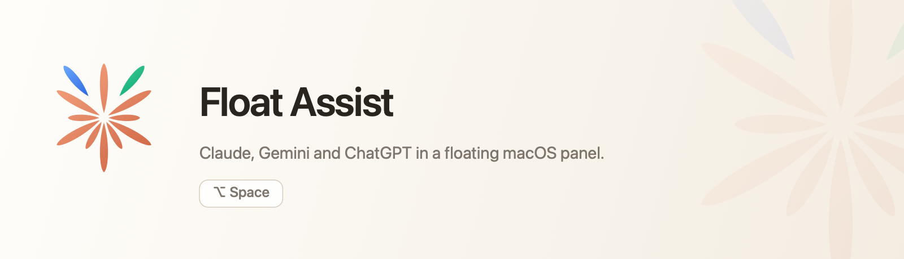

<p align="center">
  
</p>

<p align="center">
  
  
  
  
  <a href="LICENSE"></a>
</p>

<p align="center"><em><a href="README.fr.md">Lire ce document en français →</a></em></p>

---

**Float Assist** is a small native macOS app that keeps a web assistant one keystroke away.
Press a global shortcut and a floating panel appears over whatever you are doing; press it
again and the panel is gone. Claude, Gemini and ChatGPT each keep their own session, stored
by WebKit on your Mac.

It is written in Swift with SwiftUI, AppKit and WebKit. No external packages, no telemetry,
no account of its own.

## Features

- **Global shortcut.** Show or hide the floating panel from any application.
- **Ask with the clipboard.** A second shortcut opens the panel and drops the clipboard text straight into the assistant's input field.
- **Keep open.** A switch in the panel pins it so it stays visible while you click elsewhere.
- **Panel or window.** Work in the compact panel, or open the full browsing window when you need room.
- **Three assistants.** Claude, Gemini and ChatGPT, each with its own WebKit website-data store.
- **Follows you.** The panel joins every Space and floats above full-screen apps.
- **Recordable shortcuts.** Set both shortcuts in Settings and restore the defaults at any time.
- **Reset website data.** Clear cookies, caches and sign-in sessions for every assistant in one action.

## Shortcuts

| Action | Default | Where |
| --- | --- | --- |
| Show or hide the floating panel | <kbd>⌥</kbd> <kbd>Space</kbd> | Anywhere, system-wide |
| Ask with the clipboard text | <kbd>⇧</kbd> <kbd>⌥</kbd> <kbd>Space</kbd> | Anywhere, system-wide |
| Show the floating panel | <kbd>⌘</kbd> <kbd>⌥</kbd> <kbd>F</kbd> | Application menu |
| Ask with the clipboard text | <kbd>⇧</kbd> <kbd>⌘</kbd> <kbd>⌥</kbd> <kbd>F</kbd> | Application menu |
| Dismiss the panel | <kbd>esc</kbd> | Panel focused |

Both global shortcuts are editable in **Settings → Global shortcuts**. A shortcut needs at
least one modifier; clear a recorder to disable it. If macOS has already reserved a
combination, Float Assist keeps running and reports it in the window instead of failing.

## Requirements

- macOS 26 or later
- An Apple Silicon Mac
- Xcode 26 or later, to build from source

## Install

Open `FloatAssist.dmg` and drag **Float Assist** into Applications.

Builds produced by this repository are **not signed or notarised**, so the first launch
needs the usual detour: right-click the app, choose **Open**, then confirm. Sign and
notarise with your own Developer ID before distributing it further.

Float Assist runs as a menu bar app (`LSUIElement`), so it has no Dock icon — look for the
mark in the menu bar.

## Build from source

```bash
xcodebuild build \
  -project FloatAssist.xcodeproj \
  -scheme FloatAssist \
  -destination 'platform=macOS,arch=arm64' \
  CODE_SIGNING_ALLOWED=NO
```

Package a disk image from a Release build:

```bash
./scripts/create-dmg.sh \
  "./build/DerivedData/Build/Products/Release/Float Assist.app" \
  ./dist
```

Tests, the Release configuration and the disk image are covered in [docs/BUILD.md](docs/BUILD.md).

## Privacy

Float Assist has no server, no account and no analytics. It opens the assistant websites you
choose in a WebKit view; sign-in, the data you type and each service's own rules stay with
that website. Sessions live in this Mac's WebKit storage, one store per assistant, and
**Settings → Privacy → Reset Website Data** deletes all of them.

The app is sandboxed with the hardened runtime, outgoing network connections only, and no
access to the camera, microphone, contacts, calendars, location or USB.

## Built with

SwiftUI, AppKit, WebKit, Foundation, Observation and Carbon (for the global hotkeys), plus
XCTest for the test suite. Nothing else — the build instructions in this repository pull no
external package.

## Not affiliated

Float Assist is an independent project. It is not affiliated with, endorsed by or sponsored
by Anthropic, Google or OpenAI. Claude, Gemini and ChatGPT are trademarks of their
respective owners, and the mark above is an original design, not theirs. Your use of each
service remains governed by that service's own terms.

## Licence

Float Assist is released under the **MIT Licence** — see [LICENSE](LICENSE) for the full
text. Every source file in this repository carries the same notice:

```swift
//  Copyright (c) 2026 Alban Gerschheimer. Licensed under the MIT License.
```

In short: you may use, copy, modify, merge, publish, distribute, sublicense and sell copies
of the software, provided the copyright notice and the permission notice travel with it.
The software is provided "as is", without warranty of any kind.

© 2026 Alban Gerschheimer.
